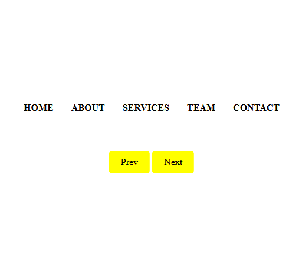

# Creative Menu Effect

A simple creative menu effect built with **HTML** and **CSS**.  
The project features animated hover lines for navigation links and smooth transitions between multiple menu pages.

## ✨ Features

- Modern hover line animation using pseudo-elements (`::before` and `::after`)
- Responsive and minimal layout
- Navigation between multiple menu pages
- Built purely with **HTML** and **CSS** (no frameworks)

## 🚀 How to Use

1. Clone or download this repository  
2. Open any of the `index.html` files (e.g. `01.Menu/index.html`) in your browser  
3. Hover over the menu items to see the animation  
4. Use the “Next” and “Prev” buttons to navigate between menus

## 🧠 Learnings

- Use of CSS transitions and transforms for animation  
- How to organize multiple pages within a single project  
- Basic folder navigation with relative paths (`../` and `./`)

## 📸 Preview

📅 **Project:** Creative Menu Effect

